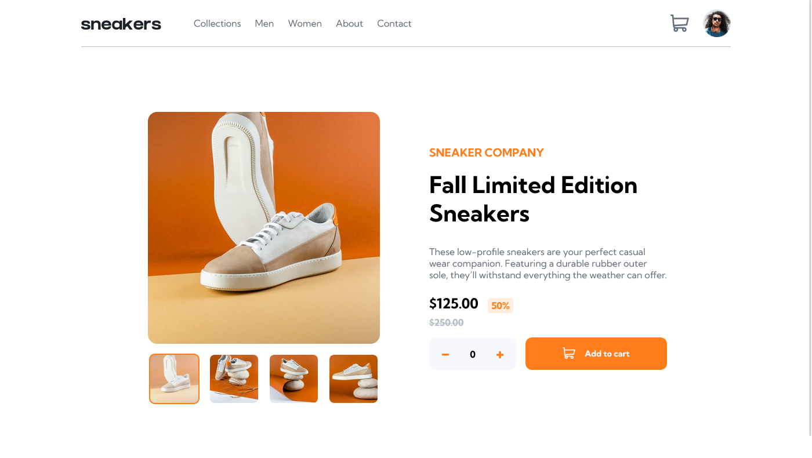

# Frontend Mentor - E-commerce product page solution

This is a solution to the [E-commerce product page challenge on Frontend Mentor](https://www.frontendmentor.io/challenges/ecommerce-product-page-UPsZ9MJp6). Frontend Mentor challenges help you improve your coding skills by building realistic projects.

## Table of contents

-   [Overview](#overview)
  - [The challenge](#the-challenge)
  - [Screenshot](#screenshot)
  - [Links](#links)
  - [Built with](#built-with)
  - [What I learned](#what-i-learned)
  - [Useful resources](#useful-resources)
  - [Author](#author)


## Overview
This is the front end mentor challenge recreation of product preview card component solution I did following my other frontend mentor code challenges

### The challenge

Users should be able to:

- View the optimal layout for the site depending on their device's screen size
- See hover states for all interactive elements on the page
- Open a lightbox gallery by clicking on the large product image
- Switch the large product image by clicking on the small thumbnail images
- Add items to the cart
- View the cart and remove items from it

### Screenshot




### Links

- Solution URL: [https://github.com/Qaphael/ecommerce-product-page](https://github.com/Qaphael/ecommerce-product-page)
- Live Site URL: [https://qaphael.github.io/ecommerce-product-page/](https://qaphael.github.io/ecommerce-product-page/)

## My process

### Built with

- Semantic HTML5 markup
- CSS custom properties
- Flexbox
- CSS Grid
- vscode

### What I learned

I learned and practiced a great deal of flex property in this challenge for positioning
I also created and learnt how to create lightbox box which i will use for feature projects.
I also created a slideshow and gained alot of knowledge in javascipt.


### Code I'm Proud of

```html
<h1>Some HTML code I'm proud of</h1>
<div class="mySlides fade">
  
</div>
```
```css
.modal {
  display: none;
  position: fixed;
  z-index: 5;
  top: 0;
  left: 0;
  width: 100%;
  height: 100%;
  background-color: hsla(0, 0%, 0%, 75%);
}
```
```js
const proudOfThisFunc = () => {
  console.log('🎉')
}

function showSlides(n) {
  let i;
  let slides = document.getElementsByClassName("mySlides");
  let dots = document.getElementsByClassName("dot");
  if (n > slides.length) {
    slideIndex = 1;
  }
  if (n < 1) {
    slideIndex = slides.length;
  }
  for (i = 0; i < slides.length; i++) {
    slides[i].style.display = "none";
  }
  for (i = 0; i < dots.length; i++) {
    dots[i].className = dots[i].className.replace(" active", "");
  }
  slides[slideIndex - 1].style.display = "block";
  dots[slideIndex - 1].className += " active";
}
```

### Useful resources

- [google fonts](https://fonts.google.com/) - This helped me for fonts i used in this challenge.
- [w3school](https://www.w3schools.com/howto/howto_js_lightbox.asp) - This helped me for creating the lightbox i used in this challenge.

## Author

- Website - [Qaphael Opiyo](https://qaphael-portfolio-website.web.app/)
- Frontend Mentor - [@Qaphael](https://www.frontendmentor.io/profile/Qaphael)
- Twitter - [@laflo_lr](https://twitter.com/Laflo_lr)
- Github - [@Qaphael](https://github.com/Qaphael)

